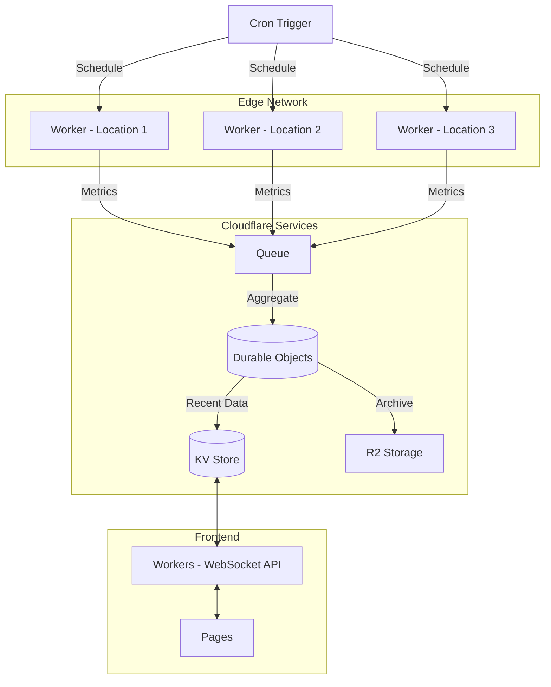

# Cloudflare Website Monitoring

This project implements a global website monitoring system using Cloudflare Workers, Durable Objects, R2, and Pages.

## Architecture



### Components
- **Edge Workers**: Monitor websites from multiple global locations
- **Queue**: Buffers and batches incoming metrics
- **Durable Objects**: Aggregates metrics and maintains consistency
- **KV Store**: Stores recent metrics for quick access
- **R2 Storage**: Archives historical data
- **WebSocket API**: Provides real-time updates to frontend
- **Pages**: Hosts the dashboard interface

## Setup

1. Install dependencies:
   ```bash
   npm install
   ```

2. Configure Cloudflare:
   - Create a new Cloudflare Workers project
   - Set up R2 bucket
   - Create KV namespace
   - Configure Queues

3. Update wrangler.toml with your configuration values

4. Deploy:
   ```bash
   npm run deploy
   npm run pages:deploy
   ```
